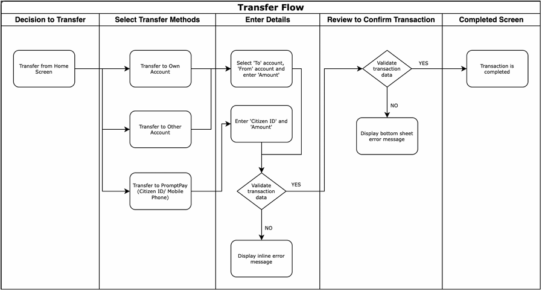

🏦💵 Mobile Banking Money Transfer Project

  This project contains manual test cases and testing documentation for a money transfer feature in a mobile banking application.

**test case design from workflow:**  
  

🔬 Scope

  • Design test cases based on the following flow:

  • Transfer from Home Screen

  • Select Transfer Method (Own/Other Account, PromptPay)

  • Enter Details (Account, Amount, Citizen ID, etc.)

  • Validate transaction

  • Transaction Completed or Show Error

  • All test cases written in English only.

## 📁 Files Included

| File Name             | Description                        |
|-----------------------|------------------------------------|
| `README.md`           | Project summary and documentation  |
| `test-cases.md`       | Detailed test-case                 |
| `test-summary.md`     | Detailed test-summary              |
| `bug-reports.md`      | Detailed bug report                |
| `test-cases.xlsx`     | test-cases excel file              |
| `tranfer-flow.png`    | workflow picture                   |

🛠️ Tools Used

  • Manual Testing with Microsoft Excel

  • Markdown for documentation

  • GitHub for version control

✅ Status

  • 28 test cases created and passed

  • Covering valid, invalid, and cancel scenarios
